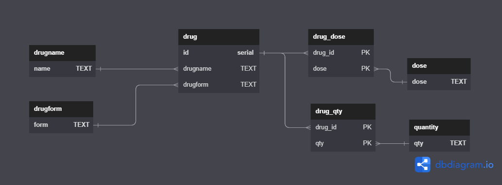

# **[RXCompare][App-Link]**

## **Overview**

https://rxcompare.up.railway.app/

RXCompare allows you to find discounted prices for prescription medications at your local U.S pharmacy. You can search for prescription medications by name and specify a zip code to locate local pharmacies. Medications can be filtered by form, dose and quantity. 

Find the best price, select a discount card and bring it to your local pharmacy!
 

## **Features**
- Search from over thousands of prescription medications.
- Filter by medication form, dose and quantity
- Locate a local pharmacy
- Links to discount cards that you can show your pharmacist and obtain discounted prices
- Up to date prices

## **Built with**
* Frontend  
  
  [![React][React.js]][React-url] [![JavaScript]][Javascript-url] [![Material-UI][MUI]][MUI-url] 
* Backend  
  
  
  
  

* Webscraper

  
  
  

* Misc. 
  
  
  
  
    
## **API Used**

[DrugScraper API](https://github.com/henrywl618/DrugScraperAPI)

Purpose built API built with Python/Flask/Selenium to scrape prescription drug information and pricing data.

## **Database Schema**

<!-- MARKDOWN LINKS & IMAGES -->
<!-- https://www.markdownguide.org/basic-syntax/#reference-style-links -->
[App-Link]: https://https://rxcompare.up.railway.app/
[React.js]: https://img.shields.io/badge/React-20232A?style=for-the-badge&logo=react&logoColor=61DAFB
[React-url]: https://reactjs.org/
[Mui]: https://img.shields.io/badge/Material--UI-0081CB?style=for-the-badge&logo=material-ui&logoColor=white
[MUI-url]: https://getbootstrap.com
[JavaScript]:https://img.shields.io/badge/javascript-%23323330.svg?style=for-the-badge&logo=javascript&logoColor=%23F7DF1E
[JavaScript-url]:https://developer.mozilla.org/en-US/docs/Web/JavaScript

